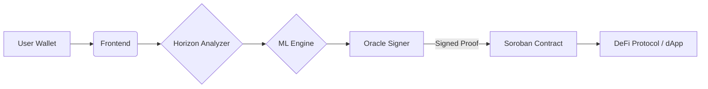

# 🛡️ Sentinel: AI-Powered Risk Engine for Stellar

> **Decentrallized "Credit Score" and Fraud Prevention Layer for the Stellar Network**

Sentinel connects **Off-Chain AI** with **On-Chain Enforcement**, enabling smart contracts to assess wallet risk in real-time using Soroban.

---

## 🔗 Quick Links
- **🚀 Website Link**: [https://sentinel-chi-ten.vercel.app/](https://sentinel-chi-ten.vercel.app/)
- **📜 Contract Address (Testnet)**: `CAR3MXRMRSOJLUNCP4L36M4VWBMGWJT5DPBAYEKQYJZEW7VQ6WQPZRDO`
- **📦 NPM Package**: [`@miraculous65/sentinel-risk-sdk`](https://www.npmjs.com/package/@miraculous65/sentinel-risk-sdk)
- **🦀 Crates.io**: [`sentinel-contract-sdk-miraculous65`](https://crates.io/crates/sentinel-contract-sdk-miraculous65)

---

## 🚩 Problem Statement
In the current blockchain ecosystem, smart contracts are "blind" to off-chain behavior. They cannot easily differentiate between a legitimate user and a known scammer or a bot farm. This leads to:
- **Fraud**: Malicious actors exploiting protocols without repercussions.
- **Sybil Attacks**: inability to gatekeep based on reputation.
- **Credit Inefficiency**: No reliable way to assess creditworthiness for undercollateralized lending.

**Sentinel solves this by bringing AI-driven risk scoring on-chain.**

---

## ✨ Features
- **🕵️ Horizon Analyzer**: Fetches real-time account history and extracts behavioral features (age, tx count, payment patterns).
- **🧠 ML Engine**: Uses a Random Forest model to compute a Risk Score (0-100).
- **✍️ Cryptographic Oracle**: Signs the risk assessment with an Ed25519 private key, creating a verifiable "Proof of Risk".
- **🛡️ Soroban Smart Contract**: Verifies the Oracle's signature on-chain and enforces permissions (Allow, Limit, Freeze).
- **⚡ Real-time UI**: A Cyberpunk-themed dashboard to visualize the analysis pipeline.

---

## 🏗️ Architecture Overview

The system operates in a verified **4-Step Core Loop**:

1.  **Ingestion**: User enters a wallet address on the **Next.js Frontend**.
2.  **Analysis (Off-Chain)**:
    -   **Service 1 (Horizon)** gathers data.
    -   **Service 2 (ML Engine)** computes the Risk Score.
3.  **Attestation (Oracle)**: The result is signed by the **Oracle Service**, ensuring data integrity.
4.  **Enforcement (On-Chain)**: The **Soroban Contract** verifies the signature and stores the `RiskState`, allowing other contracts to query permissions via Cross-Contract Calls.



---

## 📸 Screenshots

*(Please include screenshots of the dashboard, risk score visualization, and transaction flow here)*


*Real-time Risk Analysis Dashboard*

---

## 🛠️ Technology Stack

| Component | Technology | Description |
| :--- | :--- | :--- |
| **Frontend** | Next.js 14, Tailwind, Shadcn UI | Interactive Dashboard |
| **Backend** | Python, FastAPI, Scikit-Learn | AI & Data Processing |
| **Contract** | Rust, Soroban | On-chain Logic & Verification |
| **Services** | Render | Cloud Hosting |

---

## 🔮 Future Scope & Plans
-   **DeFi Integration**: Partner with lending protocols to enable undercollateralized loans based on Sentinel Scores.
-   **Enhanced AI Models**: Incorporate deep learning for detecting complex fraud patterns and wash trading.
-   **Decentralized Oracle Network**: Move from a single oracle signer to a consensus of nodes for greater security.
-   **Cross-Chain Identity**: Expand the reputation system to bridge trust across multiple blockchains.

---

## 📦 integration
Developers can integrate Sentinel using our customized SDKs:

**JavaScript/TypeScript:**
```bash
npm install @miraculous65/sentinel-risk-sdk
```

**Rust (Soroban):**
```toml
[dependencies]
sentinel-contract-sdk-miraculous65 = "0.1.0"
```

---

_Built for the Stellar Hackathon 🚀_
